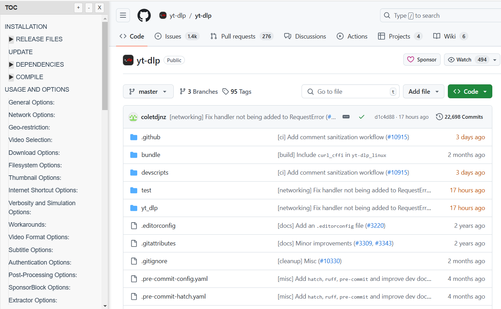
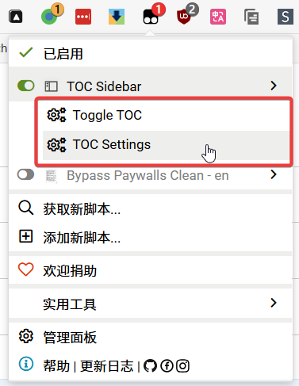

# TOC Sidebar

TOC Sidebar is a user script that adds a table of contents (TOC) sidebar to any webpage, enhancing navigation and improving the reading experience.

## Features

- Automatically generates a table of contents from the headings on the page
- Toggle sidebar visibility with the <kbd>t</kbd> key, or  Customizable global shortcut key
- Resizable sidebar
- Expand/collapse functionality for nested headings
- Highlights the current section as you scroll
- Smooth scrolling to selected headings
- Intelligent content detection to avoid including irrelevant headings
- Ability to toggle the TOC sidebar from the Tampermonkey menu

## Advantages

1. Improved navigation: Quickly jump to any section of the page
2. Enhanced readability: Get an overview of the page structure at a glance
3. Non-intrusive: Toggle the sidebar on and off as needed
4. Customizable: Resize the sidebar to your preferred width
5. Universal compatibility: Works on most websites without interfering with existing layouts

## How to Use

1. Install a user script manager like [Tampermonkey - Chrome Web Store](https://chromewebstore.google.com/detail/tampermonkey/dhdgffkkebhmkfjojejmpbldmpobfkfo) or [Greasemonkey – Firefox](https://addons.mozilla.org/en-US/firefox/addon/greasemonkey/) in your browser
2. Install the TOC Sidebar script: https://raw.githubusercontent.com/xianmin/userscript-toc-sidebar/master/toc-sidebar.user.js
3. Visit any webpage, and press the 't' key to toggle the sidebar
4. Click on any heading in the sidebar to navigate to that section
5. Use the '+' and '-' buttons to expand or collapse all headings
6. Drag the right edge of the sidebar to resize it
7. Click the 'X' button or press 't' again to close the sidebar

### Customizing the Shortcut Key

You can customize the global shortcut key used to toggle the TOC sidebar:

1. Click on the Tampermonkey icon in your browser
2. Select "TOC Settings" from the menu
3. In the settings panel, click on the "Trigger Shortcut" field
4. Press the desired key combination (e.g., Ctrl+T)
5. Click "Save" to apply the new shortcut

The new shortcut will be applied globally across all pages where the script runs.

### Toggling TOC from Tampermonkey Menu

You can also toggle the TOC sidebar directly from the Tampermonkey menu:

1. Click on the Tampermonkey icon in your browser
2. Look for the "Toggle TOC" option in the menu
3. Click on "Toggle TOC" to show or hide the sidebar

This provides an alternative way to access the TOC sidebar without using the keyboard shortcut.

Enjoy easier navigation and improved reading experience with TOC Sidebar!
